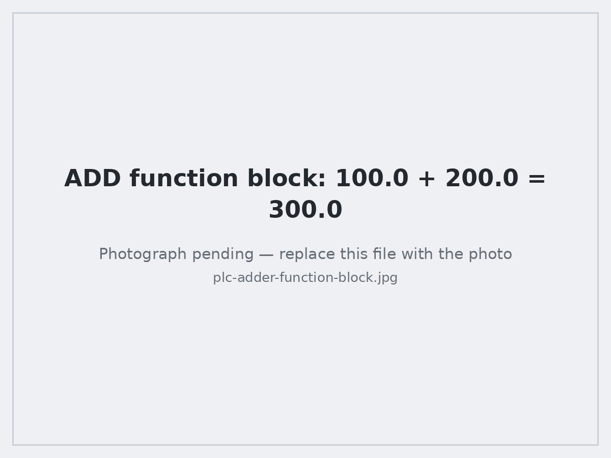

# NJIT Makerspace — Advanced Manufacturing and Mechatronics Training Program

Portfolio and technical documentation of my work in the **Pre-Apprenticeship Skills Training Program in Advanced Manufacturing and Mechatronics** at the NJIT Makerspace (New Jersey Institute of Technology).

The program is a ~4 month, two-module, hands-on training cycle in industrial manufacturing and mechatronics skills. It ends with a course-long build project: a working **motor test stand** with separate AC and DC control panels, wired and commissioned from a bill of materials, plus a set of PLC ladder-logic programs deployed to real hardware.

This repository is the record of what I built, the programs I wrote, and the skills I can demonstrate.

  
   
  <em><b>The capstone.</b> A motor test stand I fabricated, wired and commissioned from a bill of materials — single-phase AC motor behind a local disconnect, a breaker-protected AC supply, and a separate 24&nbsp;VDC control bus feeding an operator panel.</em>

---

## At a glance

| | |
|---|---|
| **Program** | Advanced Manufacturing & Mechatronics Pre-Apprenticeship Skills Training |
| **Institution** | NJIT Makerspace, New Jersey Institute of Technology |
| **Structure** | Introductory Module (8 weeks) + Advanced Module (weeks 9–14) |
| **Format** | Integrated lecture + lab, ~85% attendance requirement, all assignments completed |
| **Credential** | NJIT official Certificate of Completion |
| **Capstone** | Fabricated and commissioned an AC/DC motor test stand |
| **Controls platform** | Allen-Bradley Micro820 PLC, programmed in ladder logic with Connected Components Workbench (CCW) |

## What I can do as a result

- **Mechanical assembly** — work from written assembly instructions and a bill of materials, stage tools and hardware, build to spec, and verify dimensions and alignment after assembly.
- **Electrical assembly and wiring** — lay out and wire AC and DC panels: breakers, DIN-rail terminal blocks, a 24 VDC switch-mode power supply, disconnect switch, pilot lamps, toggle switches, cordsets with strain relief, and protective bonding.
- **PLC programming** — write, download, and debug ladder logic on a Micro820: discrete I/O, analog I/O, AND/OR logic, math and comparison blocks, counters, and timers.
- **Sensors, actuators and instrumentation** — wire and test proximity sensors (inductive, magnetic, optical) and actuators including AC motors, relays, and pneumatic cylinders and grippers; build the signal-conditioning stage that turns a raw analog transducer output into a usable, scaled reading.
- **Measurement and inspection** — calipers, micrometer-class precision reading, squares, thread gauges, tape and scale; multimeter and electrical testers for continuity, voltage, and resistance.
- **Troubleshooting and repair** — isolate faults in mechanical assemblies (alignment, wrong hardware, damage, corrosion) and electrical systems (breakers, fuses, batteries, switches and plugs), then repair and re-verify.
- **Pneumatics** — set up and tune an FRL (filter-regulator-lubricator) supply, flow control valves, push-to-connect tubing and fittings, and cylinders.
- **Shop safety** — safe operation of hand, power, and finishing tools; lockout/energy-isolation discipline before working on live equipment; PPE.

## Results in pictures

Each photo below is paired with what it shows and what it demonstrates, in the order the work actually happened.

### Part 1 — Building the motor test stand

The capstone: a bench-scale machine with a protected and bonded AC supply, a separate 24 VDC control bus, and an operator panel. Built from a bill of materials and written instructions, then commissioned. Full detail in [Capstone: Motor Test Stand](docs/04-capstone-motor-test-stand.md).

<table>
<tr>
<td width="38%"></td>
<td width="62%">
<b>Step 1 — Frame fabrication and motor mounting</b>  
<b>What you're seeing:</b> the aluminum T-slot extrusion frame with corner brackets, MDF deck panels, and adjustable leveling feet, with the AC motor bolted to the top deck.  
<b>What it demonstrates:</b> assembly from a BOM and written instructions. The frame was squared by comparing its diagonals and levelled on its feet <i>before</i> the motor went on — a twisted frame turns into motor vibration later, and vibration loosens electrical terminations.
</td>
</tr>
<tr>
<td width="38%"></td>
<td width="62%">
<b>Step 2 — AC side: protection and distribution</b>  
<b>What you're seeing:</b> inside the AC enclosure — a DIN-rail miniature circuit breaker (Eaton), terminal blocks, and the line, neutral and ground conductors landed and dressed. The incoming cordset enters through a strain-relief cord grip.  
<b>What it demonstrates:</b> circuit protection sized to protect the conductor, correct terminations with no nicked strands, and an equipment ground bonded through to the frame — the one part of a build where "close enough" isn't acceptable.
</td>
</tr>
<tr>
<td width="38%"></td>
<td width="62%">
<b>Step 3 — DC side: the 24 V control supply</b>  
<b>What you're seeing:</b> a Mean Well <b>MDR-60-24</b> DIN-rail switch-mode power supply, fed from its own branch breaker, converting line AC into the 24 VDC control bus.  
<b>What it demonstrates:</b> separating power and control voltages, and giving each branch its own protection so a fault on the control side can be isolated without dropping the whole machine.
</td>
</tr>
<tr>
<td width="38%"></td>
<td width="62%">
<b>Step 4 — DC distribution and operator panel, wired and cold-checked</b>  
<b>What you're seeing:</b> the rear of the stand. Red (+24 V) and black (0 V) push-in terminal blocks distribute the control bus down to a metal sub-panel I laid out, drilled and populated with three toggle switches and three pilot lamps. <b>The lamps are dark here — nothing has been energized yet.</b>  
<b>What it demonstrates:</b> a polarity color convention held consistently so the bus is readable at a glance, conductors dressed with service loops so a device can be pulled forward without straining a terminal, and every run continuity-checked from terminal to device <i>before</i> power was ever applied.
</td>
</tr>
<tr>
<td width="38%"></td>
<td width="62%">
<b>Step 5 — First energization</b>  
<b>What you're seeing:</b> the same panel as Step 4, now live. All three pilot lamps — red, amber and green — are <b>lit</b> and switching from their toggles.  
<b>Result:</b> the stand came up cleanly on the first attempt after the cold checks. 24 VDC present and correct on the control bus, every lamp responding to its toggle, and the motor starting, running smoothly and stopping from the local disconnect. Comparing these two photos is the whole point of a commissioning procedure: the wiring is proven <i>before</i> it is energized, so first power-up is a confirmation rather than an experiment.
</td>
</tr>
</table>

### Part 2 — PLC programs running on real hardware

Ladder logic written in Connected Components Workbench and downloaded to an Allen-Bradley **Micro820**, then verified live on a trainer with four toggle inputs, four pilot lamps, a potentiometer and an analog meter. Every program is documented rung by rung in [PLC Programs](docs/03-plc-programming.md).

<table>
<tr>
<td width="38%"></td>
<td width="62%">
<b>The bench, and where every program starts</b>  
<b>What you're seeing:</b> the working setup. On the left is the <b>Micro820</b> and its trainer — four toggle inputs, four pilot lamps, a potentiometer and an analog meter. On screen is the CCW <b>Local Variables</b> table, where each variable gets a name, alias, data type, initial value and a retentive flag.  
<b>What it demonstrates:</b> mapping the I/O and declaring types <i>first</i>, then referencing the alias in the rungs, so a program reads meaningfully instead of as a wall of raw addresses like <code>_IO_EM_DI_00</code>. Everything below was verified on this hardware, not in a simulator.
</td>
</tr>
<tr>
<td width="38%"></td>
<td width="62%">
<b>Program 1 — math function blocks</b>  
<b>What you're seeing:</b> an <code>ADD</code> function block with <code>EN</code>/<code>ENO</code> enable gating, monitored online. Input <code>A</code> = 100.0 and <code>B</code> = 200.0, and output <code>X</code> reads <b>300.0</b>.  
<b>What it demonstrates:</b> conditional arithmetic in ladder and correct use of the <code>REAL</code> data type. The values shown are live from the running controller, which is what actually proves the logic — not the code on its own.
</td>
</tr>
<tr>
<td width="38%"></td>
<td width="62%">
<b>Program 2 — counters and range clamping, downloaded and running</b>  
<b>What you're seeing:</b> a <code>CTU</code> count-up counter (count input, preset, accumulated value, reset, and a done bit driving an output coil) plus a <code>LIMIT</code> clamp block on a second rung. The output pane reads <code>Download: 1 succeeded, 0 failed</code> and the lamps are lit on the trainer.  
<b>What it demonstrates:</b> the building blocks of real machine control — event counting for batch and cycle tallies, and clamping a raw analog reading into a usable band before acting on it. Getting this right means understanding that the counter increments on the <i>rising edge</i>, not while the input is held closed.
</td>
</tr>
</table>

### Part 3 — Bench labs behind the capstone

The capstone is the headline, but it works because of the instrumentation and circuit labs underneath it. These are the ones that connect a physical measurement to a number a controller can act on.

<table>
<tr>
<td width="38%"></td>
<td width="62%">
<b>Pressure transducer and signal conditioning</b>  
<b>What you're seeing:</b> a stainless-steel <b>pressure transducer</b> (0–500 PSIG range, with a push-to-connect pneumatic port) cabled into a breadboard circuit I built around two DIP ICs, with a second breadboard carrying a further stage.  
<b>What it demonstrates:</b> the full analog signal chain — take a real physical quantity, excite the sensor, condition and scale its low-level output, and hand a controller something it can actually use. This is the lab that makes the <code>LIMIT</code> clamp in Program 2 above meaningful: raw sensor readings are noisy and out-of-range, so you condition them in hardware and bound them in software.
</td>
</tr>
<tr>
<td width="38%"></td>
<td width="62%">
<b>Analog circuit prototyping</b>  
<b>What you're seeing:</b> a two-stage circuit built around 8-pin DIP ICs on a bench breadboard, powered from the <code>Va</code>/<code>Vb</code> supplies with a toggle switch for input state.  
<b>What it demonstrates:</b> component identification and signal-level work with a meter and scope — the background that explains why industrial sensor outputs are specified as sourcing (PNP) or sinking (NPN).
</td>
</tr>
<tr>
<td width="38%"></td>
<td width="62%">
<b>Microcontroller I/O</b>  
<b>What you're seeing:</b> an Arduino Uno wired to a breadboard circuit with potentiometer inputs, filter capacitors and a diode, on a 12 VDC bench supply.  
<b>What it demonstrates:</b> reading analog inputs and driving outputs in code — the same read-decide-write pattern as a PLC scan, at a level where you can see every wire.
</td>
</tr>
</table>

> All photographs on this page are my own, taken during the program. Every one shows work I did with my own hands. Click any image to view it full size; the full set is indexed in [`images/README.md`](images/README.md).

---

## Technical documentation

The walkthrough above is the summary. These documents cover the same work in full — procedures, wiring detail, ladder diagrams, I/O maps and test results.

| Document | Contents |
|---|---|
| [Introductory Module](docs/01-introductory-module.md) | Weeks 1–8: tools, measurement, finishing, AC/DC wiring fundamentals, pneumatics, PLC basics |
| [Advanced Module](docs/02-advanced-module.md) | Weeks 9–14: mechanical and electrical assembly, troubleshooting, maintenance and repair, sensors and actuators |
| [PLC Programs](docs/03-plc-programming.md) | Every ladder-logic program I wrote, with rung-by-rung explanation, I/O mapping, and test results |
| [Capstone: Motor Test Stand](docs/04-capstone-motor-test-stand.md) | The build: frame, motor mount, AC enclosure, 24 VDC panel, wiring, commissioning, and test procedure |
| [Skills Matrix](docs/05-skills-matrix.md) | Each skill mapped to the specific work that demonstrates it — useful if you are screening against a job description |

---

## Program curriculum (for reference)

Summarized from the NJIT Makerspace program description. Trainees are recruited for a full cycle rather than for individual modules, and the Introductory Module is a prerequisite for the Advanced Module.

### Introductory Module

| Week | Topics |
|---|---|
| 1 | Program introduction and overview; career development; safety. Mechanical hand tools, hardware and materials — screwdrivers, shears, hammers, saws, wrenches |
| 2 | Mechanical measurement tools — tape measures, scales, squares, thread gauges, calipers |
| 3 | Mechanical power tools — drills, drivers, power saws. Hand finishing — files, sandpaper, steel wool, nylon mesh, abrasive pads, painting. Power finishing — grinding, sanding, buffing |
| 4 | Fundamentals of AC and DC wiring, hardware and materials — wire gauge, plugs, batteries, junction boxes, breakers, grounding |
| 5 | Electrical hand and measurement tools — strippers, lineman's pliers, electrical testers |
| 6 | Pneumatic systems — regulators, filters, flow control valves, tubing and fittings, cylinders |
| 7 | Basic mechatronics — PLC anatomy, analog and digital I/O, memory access; ladder-logic programming basics; AND/OR and analog measures; ladder logic applications |
| 8 | Module review and catch-up session |

### Advanced Module — mechanical and electrical assembly, maintenance and repair

| Week | Topics |
|---|---|
| 9 | Mechanical assembly — reading assembly instructions, organizing a BOM, preparing tools and hardware, assembly, and post-assembly measurement |
| 10 | Electrical assembly — instructions, BOM, tools and hardware, electrical assembly, post-assembly measurement |
| 11 | Basic mechanical troubleshooting — alignment and balance, correct hardware, damaged material, corrosion. Maintenance and repair — removing damaged hardware, cleaning, lubrication, sanding and painting |
| 12 | Basic electrical troubleshooting, maintenance and repair — breaker and fuse conditions, battery condition, switch and plug condition; resetting breakers and replacing fuses |
| 13 | Advanced mechatronics: PLC programming — event sequencing, continuous operation, math functions and logic expressions, counters, timers |
| 14 | Advanced mechatronics: sensors and actuators, testing and troubleshooting — motors, pneumatic devices, grippers, relays, ultrasonic/magnetic/optical proximity sensors. Real-world applications — stepper and servo control, conveyors, robotics, automated production lines |

### About the program

- **Who it is for:** current and prospective technical/engineering staff in manufacturing, people in electrical or mechanical roles moving into manufacturing, and engineering or engineering-technology students at community colleges and universities.
- **Cost:** free to admitted participants, with a stipend of up to $500 for eligible students on successful completion.
- **Requirements:** at least 85% attendance and completion of all assignments.
- **Program contact:** Dr. Ashish Borgaonkar, NJIT Makerspace.
- Cycles run across 2026; applications are reviewed on a rolling basis. See the NJIT Makerspace program page for current cycle dates and the application link.

---

*Repository maintained as a personal training portfolio. Curriculum details are summarized from publicly available NJIT Makerspace program information; all photographs and program write-ups are my own coursework.*
