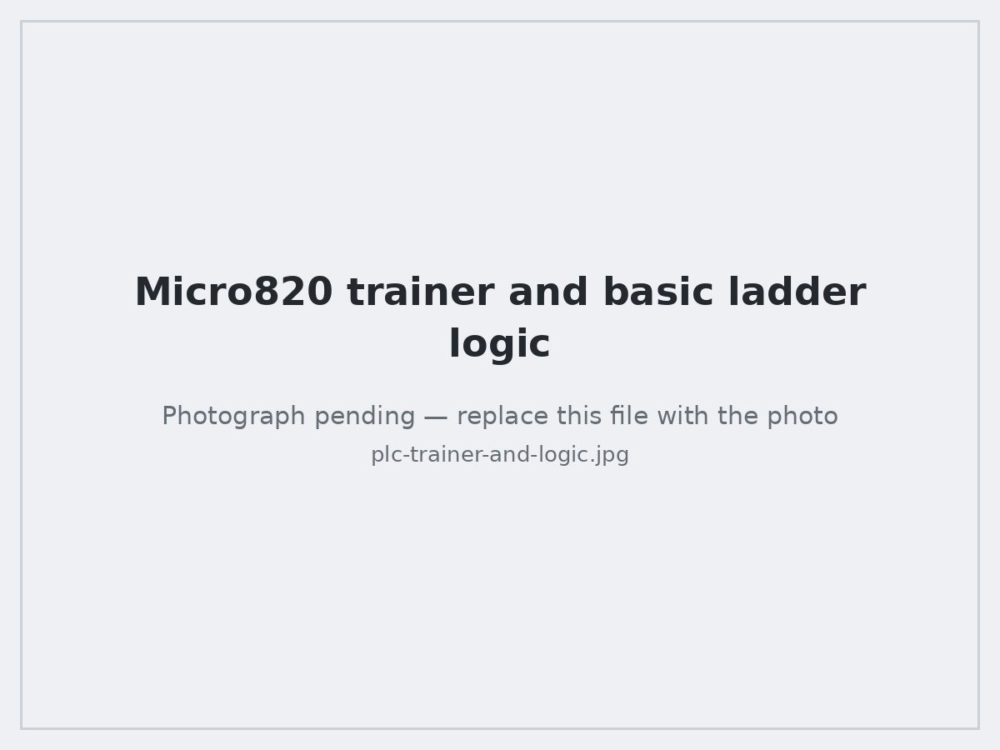
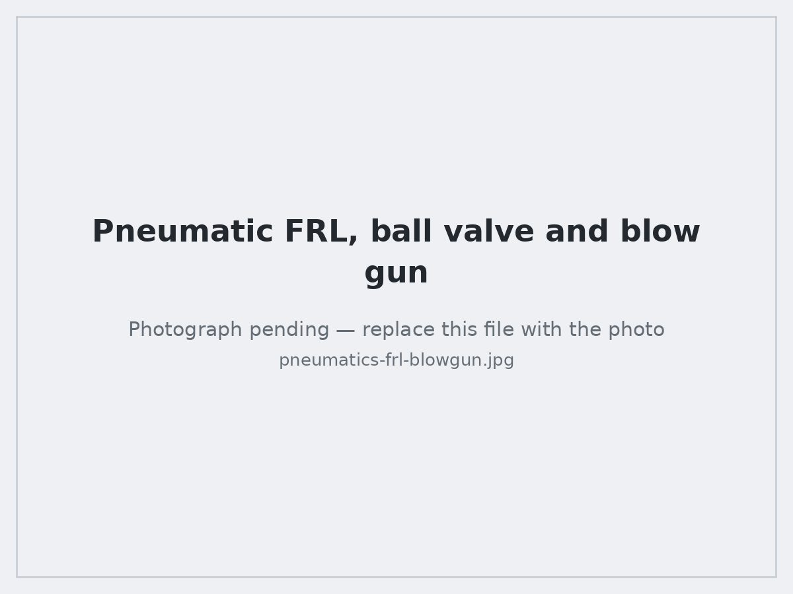

# NJIT Makerspace — Advanced Manufacturing and Mechatronics Training Program

Portfolio and technical documentation of my work in the **Pre-Apprenticeship Skills Training Program in Advanced Manufacturing and Mechatronics** at the NJIT Makerspace (New Jersey Institute of Technology).

The program is a ~4 month, two-module, hands-on training cycle in industrial manufacturing and mechatronics skills. It ends with a course-long build project: a working **motor test stand** with separate AC and DC control panels, wired and commissioned from a bill of materials, plus a set of PLC ladder-logic programs deployed to real hardware.

This repository is the record of what I built, the programs I wrote, and the skills I can demonstrate.

---

## At a glance

| | |
|---|---|
| **Program** | Advanced Manufacturing & Mechatronics Pre-Apprenticeship Skills Training |
| **Institution** | NJIT Makerspace, New Jersey Institute of Technology |
| **Structure** | Introductory Module (8 weeks) + Advanced Module (weeks 9–14) |
| **Format** | Integrated lecture + lab, ~85% attendance requirement, all assignments completed |
| **Credential** | NJIT official Certificate of Completion |
| **Capstone** | Fabricated and commissioned an AC/DC motor test stand |
| **Controls platform** | Allen-Bradley Micro820 PLC, programmed in ladder logic with Connected Components Workbench (CCW) |

## What I can do as a result

- **Mechanical assembly** — work from written assembly instructions and a bill of materials, stage tools and hardware, build to spec, and verify dimensions and alignment after assembly.
- **Electrical assembly and wiring** — lay out and wire AC and DC panels: breakers, DIN-rail terminal blocks, a 24 VDC switch-mode power supply, disconnect switch, pilot lamps, toggle switches, cordsets with strain relief, and protective bonding.
- **PLC programming** — write, download, and debug ladder logic on a Micro820: discrete I/O, analog I/O, AND/OR logic, math and comparison blocks, counters, and timers.
- **Sensors and actuators** — wire and test proximity sensors (inductive, magnetic, optical) and actuators including AC motors, relays, and pneumatic cylinders and grippers.
- **Measurement and inspection** — calipers, micrometer-class precision reading, squares, thread gauges, tape and scale; multimeter and electrical testers for continuity, voltage, and resistance.
- **Troubleshooting and repair** — isolate faults in mechanical assemblies (alignment, wrong hardware, damage, corrosion) and electrical systems (breakers, fuses, batteries, switches and plugs), then repair and re-verify.
- **Pneumatics** — set up and tune an FRL (filter-regulator-lubricator) supply, flow control valves, push-to-connect tubing and fittings, and cylinders.
- **Shop safety** — safe operation of hand, power, and finishing tools; lockout/energy-isolation discipline before working on live equipment; PPE.

## Technical documentation

| Document | Contents |
|---|---|
| [Introductory Module](docs/01-introductory-module.md) | Weeks 1–8: tools, measurement, finishing, AC/DC wiring fundamentals, pneumatics, PLC basics |
| [Advanced Module](docs/02-advanced-module.md) | Weeks 9–14: mechanical and electrical assembly, troubleshooting, maintenance and repair, sensors and actuators |
| [PLC Programs](docs/03-plc-programming.md) | Every ladder-logic program I wrote, with rung-by-rung explanation, I/O mapping, and test results |
| [Capstone: Motor Test Stand](docs/04-capstone-motor-test-stand.md) | The build: frame, motor mount, AC enclosure, 24 VDC panel, wiring, commissioning, and test procedure |
| [Skills Matrix](docs/05-skills-matrix.md) | Each skill mapped to the specific work that demonstrates it — useful if you are screening against a job description |

## Results gallery

The finished capstone build and the PLC programs running on real hardware.

### Capstone: motor test stand

<table>
  <tr>
    <td width="50%"></td>
    <td width="50%"></td>
  </tr>
  <tr>
    <td><b>Completed stand.</b> Single-phase AC motor on the deck with a local disconnect, feeding two enclosures through liquid-tight cordsets with strain-relief cord grips.</td>
    <td><b>Frame and motor mount.</b> Aluminum T-slot extrusion frame with corner brackets and leveling feet, assembled from a BOM and squared before the motor was mounted.</td>
  </tr>
  <tr>
    <td></td>
    <td></td>
  </tr>
  <tr>
    <td><b>AC side.</b> DIN-rail miniature circuit breaker, terminal blocks, and line/neutral/ground conductors landed and torqued, with bonding to the frame.</td>
    <td><b>24 VDC supply.</b> Mean Well MDR-60-24 DIN-rail power supply downstream of its own branch breaker, converting line AC to the 24 VDC control bus.</td>
  </tr>
  <tr>
    <td></td>
    <td></td>
  </tr>
  <tr>
    <td><b>DC control panel.</b> Three toggle switches and red/amber/green pilot lamps, individually wired and continuity-checked back to the terminal blocks.</td>
    <td><b>DC distribution.</b> Red (+24 V) and black (0 V) push-in terminal blocks on DIN rail, with the bus color-coded and dressed to the panel.</td>
  </tr>
</table>

### PLC ladder logic on a Micro820

<table>
  <tr>
    <td width="50%"></td>
    <td width="50%"></td>
  </tr>
  <tr>
    <td><b>Trainer and basic logic.</b> Micro820 with four toggle inputs, four pilot lamps, a potentiometer and analog meter. Rung 1 is a direct contact-to-coil; rung 2 is series contacts implementing AND.</td>
    <td><b>Math blocks.</b> An <code>ADD</code> block with <code>EN</code>/<code>ENO</code> gating, verified live: A = 100.0 and B = 200.0 produce X = 300.0 in the monitored variable values.</td>
  </tr>
  <tr>
    <td></td>
    <td></td>
  </tr>
  <tr>
    <td><b>Counters and limits, running.</b> A <code>CTU</code> count-up counter driving an output coil plus a <code>LIMIT</code> clamp block. The output pane reads <code>1 succeeded, 0 failed</code> and the lamps are lit on the trainer.</td>
    <td><b>Variable declaration.</b> Local Variables table with data types, initial values and retentive flags set before the logic was written.</td>
  </tr>
</table>

### Electrical, electronics, and pneumatics labs

<table>
  <tr>
    <td width="33%"></td>
    <td width="33%"></td>
    <td width="33%"></td>
  </tr>
  <tr>
    <td><b>Analog circuits.</b> Two-stage DIP IC circuit built on a bench breadboard and characterized with dual supplies, a meter and a scope.</td>
    <td><b>Microcontroller I/O.</b> Arduino Uno reading analog inputs and driving outputs, on a 12 VDC bench supply.</td>
    <td><b>Pneumatic supply.</b> FRL unit and regulator set to working pressure, isolated by a ball valve, distributed through a push-to-connect tee.</td>
  </tr>
</table>

> Photos live in [`images/`](images/). The files currently committed there are labelled placeholders — see [`images/README.md`](images/README.md) for the filename-to-photo map and drop each photograph in under the same filename to publish it.

---

## Program curriculum (for reference)

Summarized from the NJIT Makerspace program description. Trainees are recruited for a full cycle rather than for individual modules, and the Introductory Module is a prerequisite for the Advanced Module.

### Introductory Module

| Week | Topics |
|---|---|
| 1 | Program introduction and overview; career development; safety. Mechanical hand tools, hardware and materials — screwdrivers, shears, hammers, saws, wrenches |
| 2 | Mechanical measurement tools — tape measures, scales, squares, thread gauges, calipers |
| 3 | Mechanical power tools — drills, drivers, power saws. Hand finishing — files, sandpaper, steel wool, nylon mesh, abrasive pads, painting. Power finishing — grinding, sanding, buffing |
| 4 | Fundamentals of AC and DC wiring, hardware and materials — wire gauge, plugs, batteries, junction boxes, breakers, grounding |
| 5 | Electrical hand and measurement tools — strippers, lineman's pliers, electrical testers |
| 6 | Pneumatic systems — regulators, filters, flow control valves, tubing and fittings, cylinders |
| 7 | Basic mechatronics — PLC anatomy, analog and digital I/O, memory access; ladder-logic programming basics; AND/OR and analog measures; ladder logic applications |
| 8 | Module review and catch-up session |

### Advanced Module — mechanical and electrical assembly, maintenance and repair

| Week | Topics |
|---|---|
| 9 | Mechanical assembly — reading assembly instructions, organizing a BOM, preparing tools and hardware, assembly, and post-assembly measurement |
| 10 | Electrical assembly — instructions, BOM, tools and hardware, electrical assembly, post-assembly measurement |
| 11 | Basic mechanical troubleshooting — alignment and balance, correct hardware, damaged material, corrosion. Maintenance and repair — removing damaged hardware, cleaning, lubrication, sanding and painting |
| 12 | Basic electrical troubleshooting, maintenance and repair — breaker and fuse conditions, battery condition, switch and plug condition; resetting breakers and replacing fuses |
| 13 | Advanced mechatronics: PLC programming — event sequencing, continuous operation, math functions and logic expressions, counters, timers |
| 14 | Advanced mechatronics: sensors and actuators, testing and troubleshooting — motors, pneumatic devices, grippers, relays, ultrasonic/magnetic/optical proximity sensors. Real-world applications — stepper and servo control, conveyors, robotics, automated production lines |

### About the program

- **Who it is for:** current and prospective technical/engineering staff in manufacturing, people in electrical or mechanical roles moving into manufacturing, and engineering or engineering-technology students at community colleges and universities.
- **Cost:** free to admitted participants, with a stipend of up to $500 for eligible students on successful completion.
- **Requirements:** at least 85% attendance and completion of all assignments.
- **Program contact:** Dr. Ashish Borgaonkar, NJIT Makerspace.
- Cycles run across 2026; applications are reviewed on a rolling basis. See the NJIT Makerspace program page for current cycle dates and the application link.

---

*Repository maintained as a personal training portfolio. Curriculum details are summarized from publicly available NJIT Makerspace program information; all photographs and program write-ups are my own coursework.*
