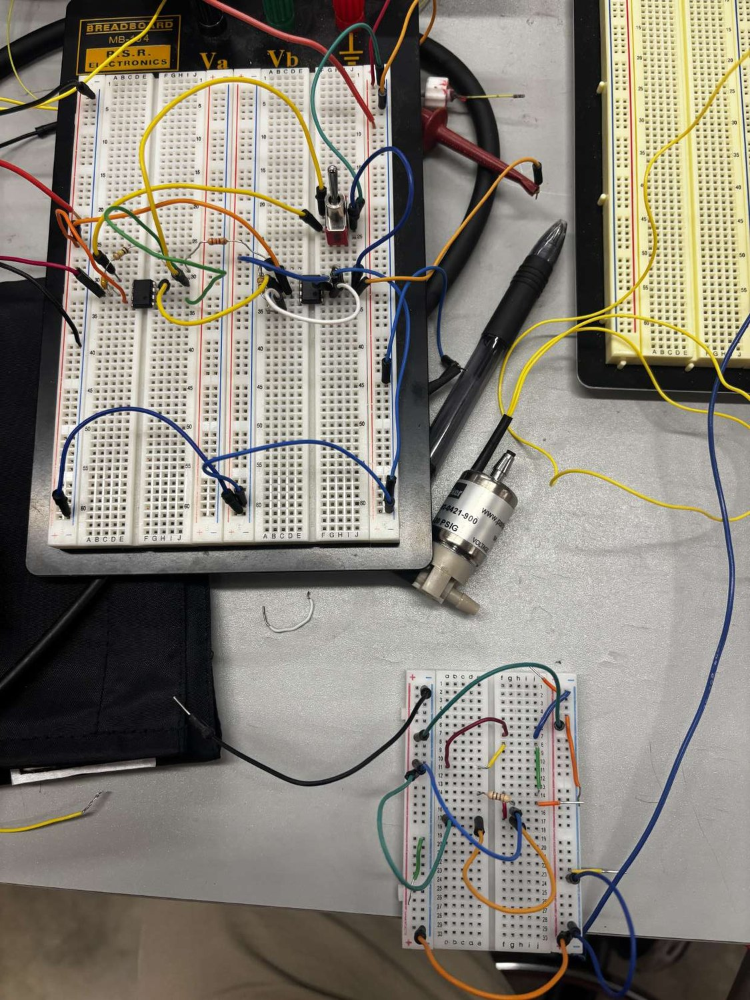
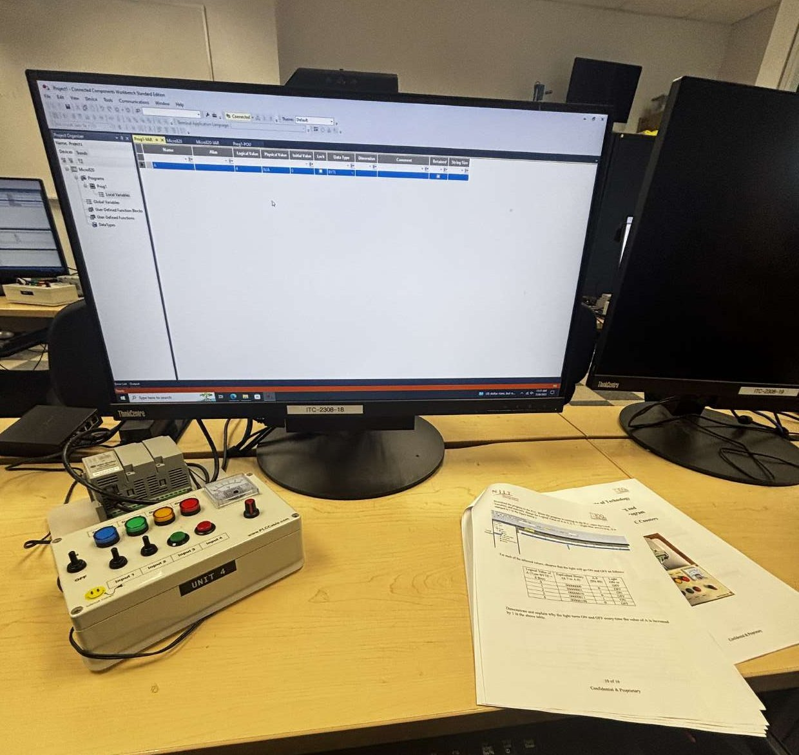

# Introductory Module (Weeks 1–8)

The Introductory Module builds the foundation: shop tools, measurement, AC and DC wiring, pneumatics, and first contact with PLCs. Every topic pairs a lecture with a lab, and every lab starts with the safety brief for the tools in use.

---

## Weeks 1–3 — Mechanical tools, measurement, and finishing

### Hand tools, hardware, and materials

Worked through screwdrivers (slotted, Phillips, Torx), shears, hammers, hand saws, and wrenches, and — more importantly — which fastener and material each one belongs to. The practical takeaway is matching the driver to the fastener so the head is not damaged, and choosing the right saw tooth pitch for the material.

**Habits I carried into the capstone build:**
- Match driver type and size to the fastener before applying force; a loose fit strips the head.
- Support and clamp the workpiece rather than holding it — the cut or the drill will grab.
- Cut on the waste side of the line and leave material for finishing.

### Mechanical measurement tools

| Tool | Use | Typical resolution |
|---|---|---|
| Tape measure | Rough and medium layout over long spans | 1/16 in |
| Steel scale / rule | Layout and short measurements | 1/64 in, 0.5 mm |
| Combination and try square | Squareness, marking 90° and 45°, depth setting | — |
| Thread gauge (pitch gauge) | Identifying thread pitch and series on unknown fasteners | — |
| Dial / digital caliper | Outside, inside, step and depth measurement | 0.001 in, 0.02 mm |

Practiced zeroing a caliper before use, reading over the same feature repeatedly to check repeatability, and identifying an unknown bolt by combining a caliper reading of the major diameter with a thread pitch gauge.

### Mechanical power tools

Corded and cordless drills, impact drivers, and power saws. Drill speed and feed selection by material, pilot-hole sizing before driving screws into stock, and clamping so the workpiece cannot rotate into the operator. Covered bit and blade selection, chuck and blade-change procedures, and de-energizing (unplug / remove battery) before any change.

### Finishing — hand and power

Hand finishing with files (single-cut vs. double-cut, draw filing), sandpaper grit progression, steel wool, nylon mesh, abrasive pads, and painting including surface prep and thin, even coats. Power finishing with bench grinders, powered sanders and buffers, plus attachment-driven work using a drill and a Dremel.

The finishing sequence I use: deburr sharp edges with a file, work grit progressively coarse-to-fine without skipping more than one step, clean the dust off completely, then prime and paint.

---

## Week 4 — AC and DC wiring fundamentals

Component identification and correct application, which is the basis for everything in the Advanced Module.

**Covered:**
- **Conductors** — wire gauge (AWG) selection against current and length, stranded vs. solid, and insulation types and ratings.
- **Grounding and bonding** — equipment grounding conductors, bonding metal enclosures and frames, and why the ground path must be continuous back to the source.
- **Protection** — miniature circuit breakers and fuses, and the idea that protection is sized to protect the *conductor*, not the load.
- **Distribution** — junction boxes, fill and support, plugs and cordsets, strain relief, and DIN-rail terminal blocks.
- **DC sources** — batteries, series and parallel arrangement for voltage and capacity, and switch-mode DC supplies.
- **Color convention** — line, neutral, and ground on the AC side; red for positive and black for common on the 24 VDC side.

**Safety discipline:** verify de-energized before touching a conductor, treat every circuit as live until proven otherwise, and never rely on a switch position alone.

---

## Week 5 — Electrical hand and measurement tools

| Tool | What I used it for |
|---|---|
| Wire strippers | Stripping to gauge without nicking strands |
| Lineman's pliers | Gripping, twisting and cutting conductors |
| Crimpers | Ferrules and ring/fork terminals, with a pull test on the finished crimp |
| Non-contact voltage tester | First-pass check for presence of voltage |
| Digital multimeter | AC/DC voltage, continuity, and resistance |

Practiced the verification routine that carried through the whole program: prove the meter on a known live source, de-energize, re-test to prove dead, then work. Continuity checks on every wire from terminal to device before energizing.

---

## Week 6 — Pneumatic systems

Built pneumatic circuits from supply through to actuator:

1. **Supply and conditioning** — an FRL (filter/regulator, with lubricator where used) removes moisture and particulates and sets a stable working pressure. Regulator adjusted while watching the gauge, then locked.
2. **Isolation** — a ball valve with a quick-connect coupler so the downstream circuit can be vented and worked on safely.
3. **Distribution** — push-to-connect fittings, tees and elbows in polyurethane tubing, cut square so the fitting seals.
4. **Control** — flow control (needle) valves to set cylinder speed, and directional valves to select extend/retract.
5. **Actuation** — single- and double-acting cylinders, and end-of-stroke sensing.

**Safety:** vent stored pressure before breaking any connection, restrain tubing so a released line cannot whip, and never point a blow gun at skin.

**Measuring pressure electrically.** A gauge tells an operator the pressure; a controller needs a signal. On the bench I wired a pressure transducer (0–500 PSIG, with a push-to-connect port on the process side) into a signal-conditioning circuit so its low-level output could be scaled into a usable analog reading — the link between a pneumatic circuit and a PLC analog input.

---

## Week 7 — Basic mechatronics: PLC anatomy and ladder-logic basics

First contact with the **Allen-Bradley Micro820** controller, programmed over Ethernet from **Connected Components Workbench (CCW) Standard Edition**, using a PLC trainer with four toggle inputs, four indicator lamps, a potentiometer, and an analog panel meter.

**PLC anatomy:** power supply, CPU and scan cycle, program and data memory, embedded digital inputs and outputs, embedded analog inputs, and the plug-in/expansion concept. Understanding the scan — inputs are read, logic is solved top-to-bottom, then outputs are written — explains most beginner surprises in ladder logic.

**Addressing and variables:** embedded I/O appears as `_IO_EM_DI_xx` for digital inputs and `_IO_EM_DO_xx` for digital outputs. Before writing logic I declare variables in the **Local Variables** table with a name, alias, data type, initial value, and retentive flag, then use the alias in the rungs so the program reads meaningfully instead of by raw address.

**Ladder-logic basics covered:**
- Normally-open and normally-closed contacts, and output coils.
- Series contacts = **AND**; parallel branches = **OR**.
- Latching and unlatching an output, and the seal-in (holding) contact pattern.
- Analog input scaling and comparison against a setpoint.
- Building, downloading to the controller, and monitoring live values to confirm behavior.

Full program listings, rung-by-rung, are in [PLC Programs](03-plc-programming.md).

---

## Week 8 — Review and cross-unit verification

Re-ran the measurement and PLC labs, and confirmed the ladder programs downloaded and behaved identically on a different trainer unit than the one they were written on — a useful reminder that I/O mapping is per-machine.
