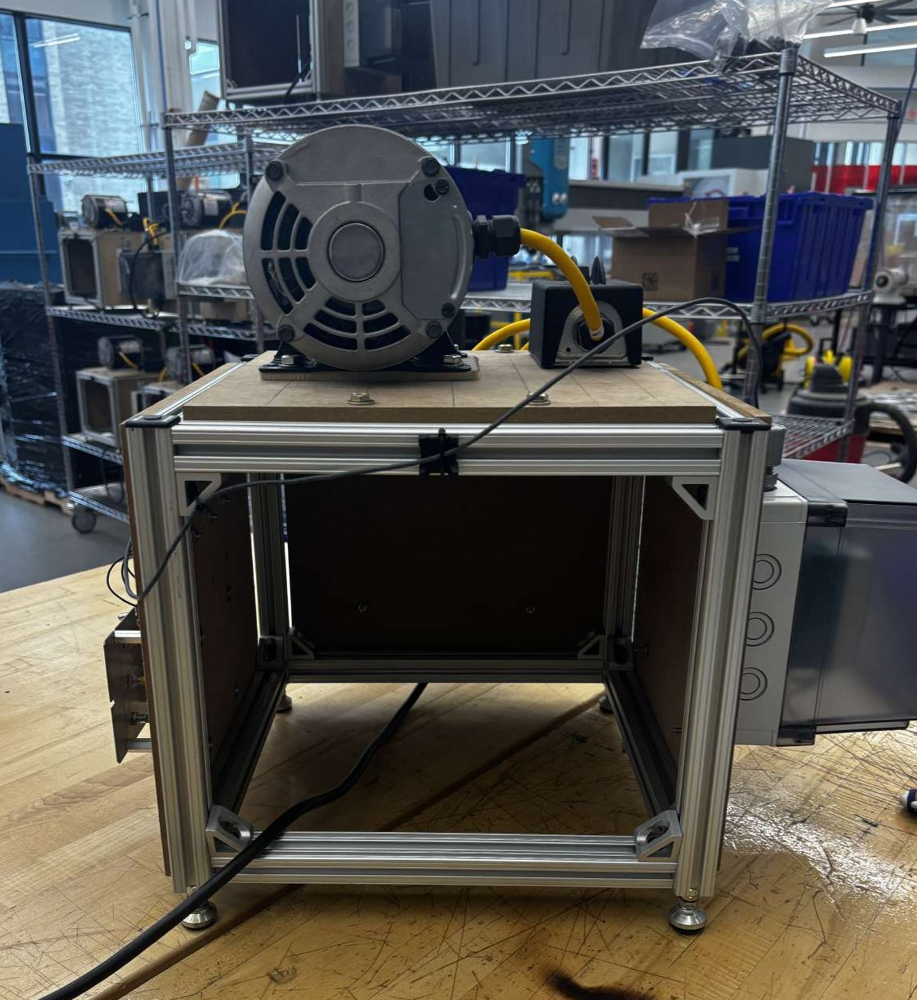
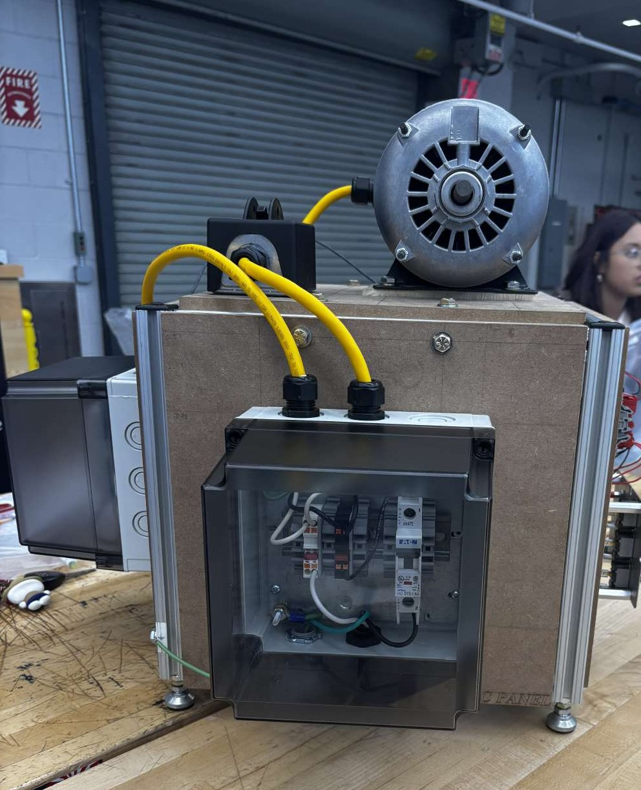
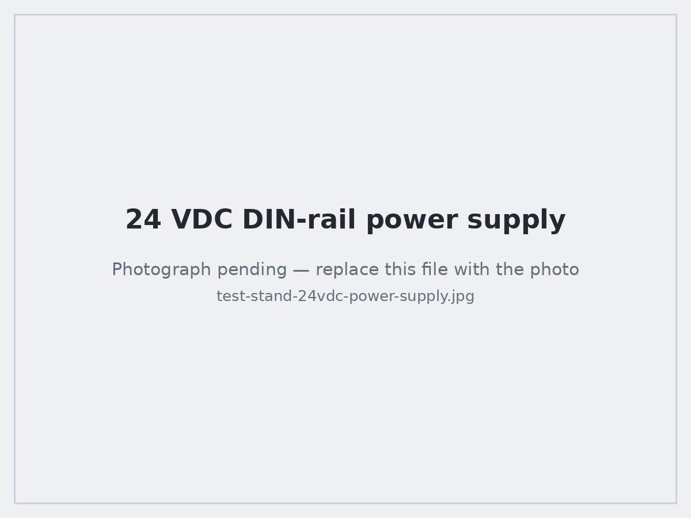
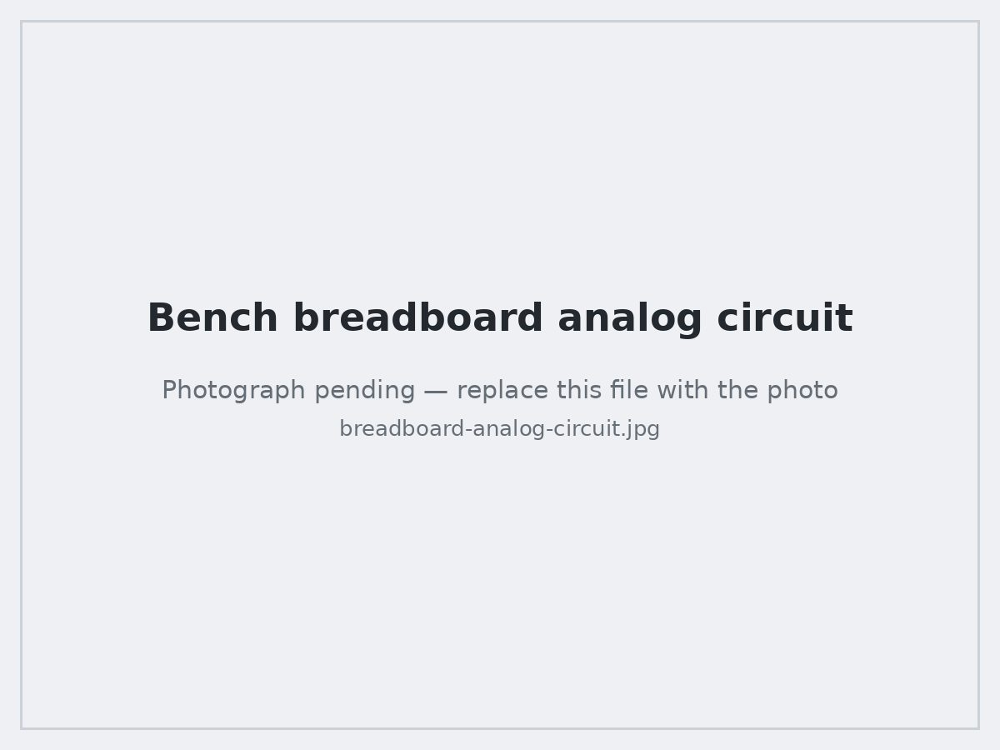
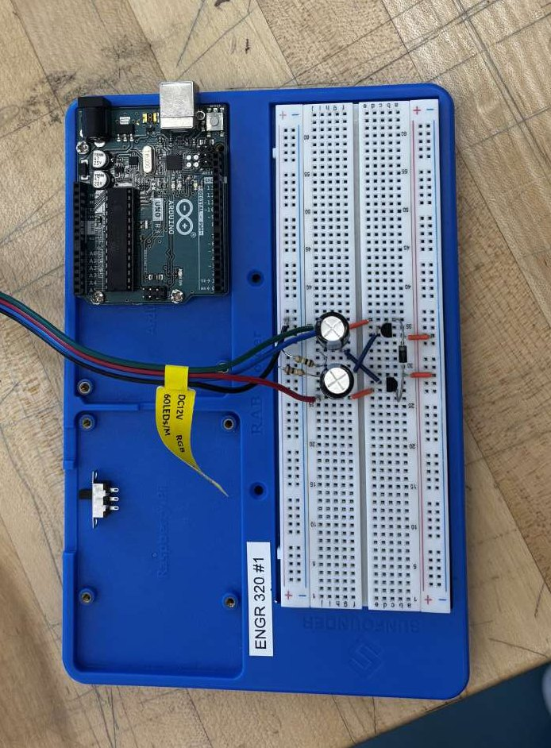
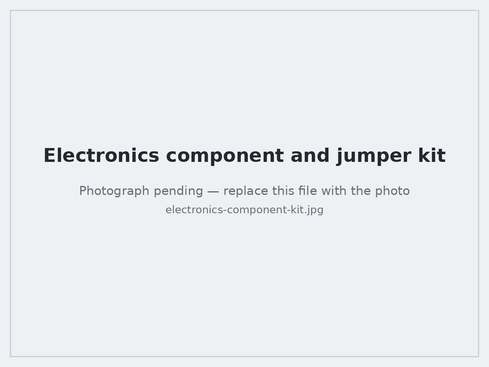

# Advanced Module (Weeks 9–14)

The Advanced Module takes every topic from the Introductory Module and applies it to a real piece of equipment. The through-line is a course-long project — a motor test stand — that gets fabricated, wired, commissioned, deliberately faulted, and repaired.

The build itself is documented separately in [Capstone: Motor Test Stand](04-capstone-motor-test-stand.md).

---

## Week 9 — Mechanical assembly

Worked from written assembly instructions and a bill of materials rather than from a picture, which is the actual industrial workflow.

**Process I followed:**

1. **Read the full instruction set first.** Identify the sequence and any step that becomes impossible later (fasteners that must go in before a panel closes, for example).
2. **Organize the BOM.** Count and sort every part into labeled trays, confirm quantities against the list, and flag shortages *before* starting rather than mid-build.
3. **Stage tools and hardware.** Lay out only the tools the step needs, with the correct drivers and wrench sizes.
4. **Assemble.** Frame first, squared and snug, then final-torque in a cross pattern once alignment is confirmed.
5. **Measure after assembly.** Verify overall dimensions, diagonals for square, and that mounting hole patterns line up with the components that come next.

**Applied to the stand:** aluminum T-slot extrusion frame with corner brackets, MDF deck panels, leveling feet, and the motor mount. The frame was checked for square by comparing diagonals and levelled on its feet before the motor went on, because a motor mounted to a twisted frame will show up later as vibration.

---

## Week 10 — Electrical assembly

The same discipline applied to the electrical side: instructions, BOM, staged tools, assembly, then post-assembly verification with a meter before anything is energized.

**What went into the panels:**

| Subsystem | Components |
|---|---|
| AC supply | Line cordset with strain-relief cord grip, DIN-rail miniature circuit breaker, terminal blocks, protective bonding to the frame |
| Motor circuit | Local disconnect switch in its own box on the deck, motor leads in liquid-tight cordset |
| DC control | Mean Well MDR-60-24 DIN-rail 24 VDC power supply on its own branch breaker |
| DC distribution | Red (+24 V) and black (0 V) push-in DIN-rail terminal blocks |
| Operator panel | Three toggle switches and red, amber and green pilot lamps on a metal sub-panel |

**Workmanship points I was graded and self-checked on:**
- Strip length to the terminal, no nicked or cut strands, no copper visible past the terminal.
- Ferrules on stranded conductors into screw terminals, with a pull test on each.
- Conductors dressed and bundled with service loops so a device can be pulled forward without tension.
- Cordsets landed in cord grips, never taking strain on the terminals.
- Ground continuity from the cord's equipment ground to the enclosure and to the frame, verified with a meter.
- Color convention held consistently so the next technician can read the panel.

<table>
<tr>
<td width="50%"></td>
<td width="50%"></td>
</tr>
<tr>
<td align="center">AC enclosure: breaker, terminal blocks and bonding</td>
<td align="center">DC side: MDR-60-24 supply on its own branch breaker</td>
</tr>
</table>

**Post-assembly verification, before first energization:**
1. Visual inspection against the drawing, terminal by terminal.
2. Continuity check on every conductor from source terminal to destination terminal.
3. Insulation/short check: line-to-neutral, line-to-ground, neutral-to-ground with the load isolated.
4. Ground bond continuity from the plug pin to the frame.
5. Breakers open, then energize, then confirm 24 VDC on the DC bus at the terminal blocks with a meter before connecting the control panel.

---

## Week 11 — Mechanical troubleshooting, maintenance, and repair

### Troubleshooting

Learned and practiced a structured inspection instead of guessing:

| Symptom | What to check |
|---|---|
| Vibration or noise under load | Shaft and coupling alignment, balance, loose mounting bolts, resonance from an unsupported frame |
| Assembly will not sit flat or bind | Frame square and level, twisted member, over-torqued bracket pulling the joint out of position |
| Fastener won't hold torque | Wrong hardware — wrong grade, wrong thread pitch, wrong length so threads bottom out |
| Surface degradation | Damaged/gouged material, corrosion at dissimilar-metal joints and at fastener heads |

### Maintenance and repair

- Extract damaged or seized hardware without damaging the parent material, and replace with correct-grade hardware.
- Clean and degrease, then lubricate bearings and sliding surfaces with the correct lubricant and quantity.
- Sand out surface damage, prep, prime, and repaint to restore corrosion protection.
- Re-verify with measurement afterward — a repair is not finished until the original check that failed now passes.

---

## Week 12 — Electrical troubleshooting, maintenance, and repair

**Diagnostics practiced:**

| Check | Method |
|---|---|
| Breaker condition | Position vs. tripped state, continuity across the poles with the circuit de-energized, and confirmation that a reset holds under load |
| Fuse condition | Continuity across the element; identify why it opened before replacing it |
| Battery condition | Terminal voltage at rest and under load, plus terminal corrosion |
| Power switch condition | Continuity in each position, contact resistance, mechanical feel |
| Plug and cordset condition | Pin damage, strain relief integrity, conductor continuity end-to-end, insulation resistance |

**Repairs:** resetting a tripped breaker after identifying the cause, replacing a fuse with the correct type and rating (never a larger one), re-terminating a damaged conductor, and re-testing before returning the equipment to service.

The rule that got reinforced constantly: **find the cause, then replace the protective device.** Resetting a breaker or swapping a fuse without diagnosing the fault just resets the clock on the same failure.

---

## Week 13 — Advanced mechatronics: PLC programming

Built on the ladder-logic basics with the constructs that make a program behave like real machine control:

- **Event sequencing** — stepping through states so operations happen in a defined order rather than all at once.
- **Continuous operation** — latching and seal-in logic so a machine keeps running after a momentary start input, and stops on a stop condition.
- **Math and logic expressions** — arithmetic function blocks with `EN`/`ENO` enable gating, and comparison against setpoints.
- **Counters** — `CTU` count-up with preset, accumulated value, done bit, and reset.
- **Timers** — on-delay and off-delay for debounce, dwell, and staged start.

Programs, rung diagrams, I/O maps, and observed test results are in [PLC Programs](03-plc-programming.md).

---

## Week 14 — Sensors, actuators, testing, and real-world applications

### Actuators

| Actuator | What I did |
|---|---|
| AC induction motor | Wired through a disconnect and breaker, started and stopped it, and observed inrush vs. running behavior on the stand |
| Relays and contactors | Used a low-voltage control signal to switch a higher-power load; identified coil vs. contact terminals and NO/NC contacts |
| Pneumatic cylinders | Drove extend/retract through directional valves, and tuned stroke speed with flow control valves |
| Grippers | Actuated pneumatic grippers and sensed open/closed state |
| Stepper and servo motors | Commanded position and speed, and observed the difference between open-loop stepping and closed-loop servo correction |

### Sensors

| Sensor type | Sensing principle | Notes from bench testing |
|---|---|---|
| Inductive proximity | Eddy-current change from metal in the field | Metal targets only; sensing range varies with target material |
| Magnetic / reed | Field from a magnet closes the contact | Used for cylinder end-of-stroke detection |
| Optical (photoelectric) | Beam interruption or reflection | Diffuse vs. reflective vs. through-beam; sensitive to reflectivity and ambient light |
| Ultrasonic | Time of flight of a sound pulse | Works on most materials; affected by soft/angled surfaces |

For each sensor: identify the wiring (supply, common, and output), determine sourcing (PNP) vs. sinking (NPN) output, wire it to a PLC digital input, and confirm the input bit changes state in the CCW monitor as the target moves. Setting the sensing distance and confirming a repeatable, chatter-free switch point is the part that actually takes the time.

### Real-world applications

Closed the module on where these pieces go in industry: conveyor start/stop and jam detection with proximity sensors, pick-and-place with pneumatic actuators and grippers, robotic cells, and automated production lines where PLC sequencing coordinates the whole thing.

---

## Electronics and microcontroller bench work

Alongside the PLC work, bench sessions on the analog and microcontroller side — useful context for why industrial I/O modules behave the way they do.

<table>
<tr>
<td width="33%"></td>
<td width="33%"></td>
<td width="33%"></td>
</tr>
<tr>
<td align="center">Multi-stage analog circuit on the bench breadboard</td>
<td align="center">Arduino Uno reading analog inputs and driving outputs</td>
<td align="center">Components staged and organized before a build</td>
</tr>
</table>

- Built multi-stage circuits with 8-pin DIP ICs on a bench breadboard, powered from dual `Va`/`Vb` supplies, with a toggle switch for input state, and characterized the output with a meter and scope.
- Wired an Arduino Uno to a breadboard circuit with potentiometer inputs, filter capacitors and a diode, on a 12 VDC supply — reading analog inputs and driving outputs in code, which is the same read-decide-write pattern as a PLC scan.
