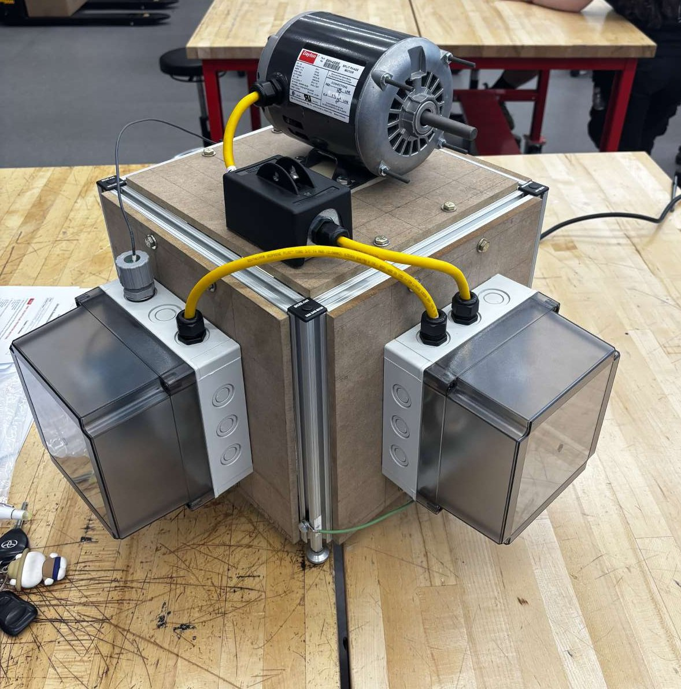
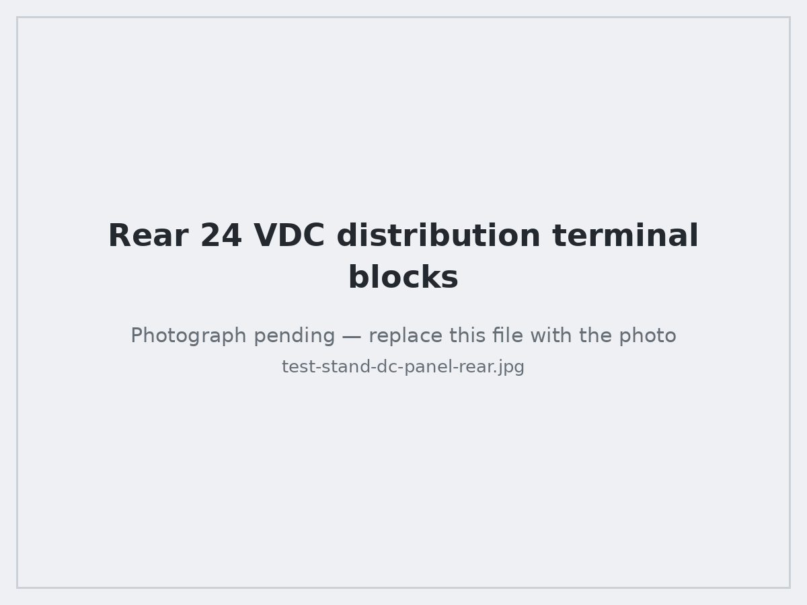
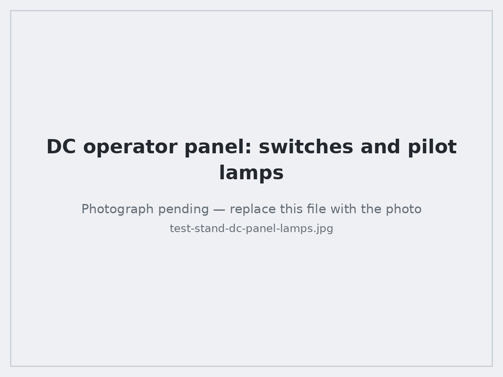

# Capstone Project — AC/DC Motor Test Stand

The course-long project of the Advanced Module: fabricate, wire, and commission a motor test stand from a bill of materials and written instructions, then use it as the platform for troubleshooting, maintenance and repair exercises.

The stand puts a single-phase AC motor on a rigid frame, with a properly protected and bonded AC supply, a separate 24 VDC control bus, and an operator panel of switches and pilot lamps — the same architecture as a real machine control cabinet, at bench scale.

---

## What it is

| Subsystem | Description |
|---|---|
| **Frame** | Aluminum T-slot extrusion with corner brackets, MDF deck and side panels, adjustable leveling feet |
| **Prime mover** | Single-phase AC induction motor (Dayton) bolted to the top deck |
| **Motor isolation** | Local disconnect switch in its own enclosure on the deck, in the motor circuit |
| **AC enclosure** | Clear-cover polycarbonate enclosure: DIN-rail miniature circuit breaker (Eaton), terminal blocks, line/neutral/ground distribution, frame bonding |
| **DC power** | Mean Well **MDR-60-24** DIN-rail switch-mode supply (24 VDC), fed from its own branch breaker |
| **DC distribution** | Red (+24 V) and black (0 V) push-in DIN-rail terminal blocks on the rear panel |
| **Operator panel** | Metal sub-panel with three toggle switches and red, amber and green indicator lamps |
| **Interconnect** | Yellow liquid-tight cordsets between deck and enclosures, landed in strain-relief cord grips; green equipment grounding conductor to the frame |

---

## Bill of materials (as-built categories)

| Category | Items |
|---|---|
| Structure | T-slot extrusion lengths, corner brackets and gussets, T-nuts and button-head screws, MDF deck and side panels, leveling feet |
| Mechanical | Motor mounting bolts, washers, lock hardware, cable tie mounts |
| Enclosures | Two clear-cover polycarbonate enclosures, DIN rail, enclosure mounting hardware, cord grips |
| AC electrical | Line cordset with plug, miniature circuit breakers, terminal blocks and end stops, jumper bars, motor disconnect switch and box, liquid-tight cordsets |
| DC electrical | 24 VDC DIN-rail power supply, push-in terminal blocks in red and black, toggle switches, indicator lamps, hookup wire, ferrules |
| Bonding | Green equipment grounding conductors, ground lugs, star washers for paint-piercing bonds |

Organizing and verifying the BOM before starting is a graded step, and in practice it is what keeps a build from stalling. Every part is counted into a labeled tray and checked against the list; shortages are flagged up front, not discovered halfway through a step.

---

## Build sequence

### 1. Frame fabrication and squaring

Cut and deburred extrusion, assembled the cube with corner brackets, then **squared it by comparing diagonals** before final-torquing anything. Levelling feet adjusted so the deck sits flat. This step matters more than it looks: a twisted frame shows up later as motor vibration and as enclosure covers that won't seat.

### 2. Motor mounting

Located the motor on the deck, transferred and drilled the mounting hole pattern, and bolted it down with washers and locking hardware, torqued in a cross pattern. Verified the shaft was clear and the motor sat flat with no rocking.

### 3. Enclosure mounting and cordset routing

Mounted both enclosures to the frame, drilled and grommeted the entries, and installed cord grips. Liquid-tight cordsets routed between the deck and enclosures with service loops and secured with cable tie mounts, so **no conductor takes mechanical strain at a terminal**.

### 4. AC panel wiring

DIN rail, breakers, and terminal blocks laid out and landed:
- Incoming line cordset into a cord grip, conductors to the main breaker.
- Line/neutral/ground distributed to terminal blocks with end stops and clear marking.
- Motor circuit out to the local disconnect on the deck, then to the motor.
- Equipment ground bonded to the enclosure and to the frame with a star washer to pierce the finish.

### 5. DC power and distribution

The 24 VDC supply on its own DIN rail behind its own branch breaker, output to the red (+24 V) and black (0 V) push-in terminal blocks on the rear panel. Color-coding held strictly so polarity is readable at a glance.

### 6. Operator panel

Laid out and drilled the metal sub-panel for three toggle switches and three indicator lamps, mounted the devices, then wired each one individually back to the terminal blocks and continuity-checked it before the bus was energized.

---

## Commissioning procedure

Nothing gets energized until it has been proven cold.

**Pre-energization (de-energized checks)**
1. Visual inspection against the wiring drawing, terminal by terminal.
2. Torque check on every terminal; tug test on every conductor.
3. Continuity from source terminal to destination terminal on every conductor.
4. Short check: line-to-neutral, line-to-ground, and neutral-to-ground with loads isolated.
5. Ground bond continuity from the plug's ground pin through to the frame and to each enclosure.
6. All breakers open, disconnect open, all switches off.

**First energization**
1. Energize the main breaker only. Verify line voltage at the incoming terminals, and verify no voltage where there should be none.
2. Close the DC branch breaker. Verify **24 VDC** at the DC terminal blocks with correct polarity before the control panel is connected.
3. Connect and verify the operator panel: each toggle lights its intended lamp, one at a time.
4. Close the motor circuit with the local disconnect and confirm the motor starts, runs smoothly, and stops from the disconnect.

**Functional verification**
- Each toggle switch operates its intended lamp and only that lamp.
- Motor starts and stops from the disconnect; runs without abnormal vibration or noise.
- Each breaker isolates only the circuit it is supposed to isolate.
- Opening the main breaker de-energizes everything downstream.

**Result:** the stand energized cleanly — 24 VDC present and correct on the control bus, all three pilot lamps operating from their toggles, and the motor starting, running, and stopping from the local disconnect.

---

## Troubleshooting exercises performed on the stand

Once the stand worked, it became the fault-finding platform. Faults were introduced and diagnosed with a meter and a structured approach rather than by swapping parts:

| Fault introduced | How it was found |
|---|---|
| Lamp doesn't light | Voltage present at the terminal block but not at the lamp → open conductor or a bad termination; continuity check isolated the segment |
| No 24 VDC on the control bus | Traced upstream: branch breaker tripped/open, then confirmed supply output before suspecting the supply itself |
| Breaker trips on energization | Isolated the branch, then short-checked line-to-ground and line-to-neutral with the load disconnected to find the fault before resetting |
| Motor won't start | Confirmed voltage at the disconnect, then at the motor leads, to determine whether the fault was upstream of or inside the motor circuit |
| Ground continuity lost | Bond continuity check from the plug pin to the frame; paint under a lug was the cause, fixed with a star washer |
| Loose termination causing intermittent operation | Torque check and tug test on every terminal in the affected circuit |
| Vibration under load | Checked mounting bolt torque, frame square and level, and motor seating |

**The governing rule:** identify the *cause* before resetting a breaker or replacing a fuse, and always re-run the verification that failed after the repair.

---

## What the project taught me

- Building from an instruction set and BOM is a process skill in itself — reading ahead, staging, and verifying at each step avoids rework that is far more expensive than the check.
- Verification before energization is not optional paperwork. The cold checks caught mistakes that would otherwise have become a trip or a damaged component.
- Workmanship — strip length, ferrules, wire dress, color convention, strain relief, labeling — is what makes a panel maintainable by the next person, and it is visible to anyone who opens the cover.
- Bonding and grounding is the one part of the build where "close enough" is not acceptable.
- Mechanical and electrical work are coupled: a frame that isn't square turns into vibration, and vibration turns into loosened terminations.
